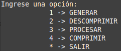

# Trabajo Práctico Final - Entorno de programación
El objetivo del trabajo práctico es diseñar y escribir un programa para procesar un lote de imágenes. Este programa consta de **tres partes principales**:
* Generar y descargar las imágenes a través
de un servicio web
* Aplicar una transformación solamente a las imágenes de
personas.
* Generar un archivo comprimido con las imágenes
procesadas.

## Requisitos Previos
Es necesario de antemano descargar e instalar [docker](https://www.docker.com/) y [git](https://git-scm.com/), para descargar y ejecutar el repositorio correctamente.


## Instalación
1. Dentro de la terminal de preferencia, nos ubicamos en el directorio donde deseamos guardar el repositorio.
2. Ingresamos los siguientes comandos:
   
   Para clonar el repositorio:
   ``` 
   git init
   git clone https://github.com/FrancoJalil/entorno.git 
   ```

   Para crear la imagen a partir del dockerfile:
   ```
   docker build . -t myapp
   ```

   Para crear el contenedor, ejecutar la imagen y establecer un directorio para guardar los archivos compartidos:

   LINUX:
   ```
   docker run -it -v /home/user/ejemplo:/app/archivos_comprimidos/ myapp
   ```

   WINDOWS:
   ```
   docker run -it -v C:/Users/user/ejemplo:/app/archivos_comprimidos/ myapp
   ```

   // donde '/home/user/ejemplo' o  'C:/Users/user/ejemplo' es la ruta donde se guardarán los archivos creados con el programa.
   
 3. Por defecto, el archivo **./menu.sh** es ejecutado, por lo que ya estamos corriendo el programa en el container de docker. 
   
    La terminal debe resultar con este aspecto: 

    


## Posibles errores


1. Con sistemas en linux, es posible que al tratar de ejecutar alguno de los comandos nos aparezca un error iniciado con 
```
docker: Got permission denied
```

Es ese caso con incluir al inicio el comando **sudo** nos permite continuar con la ejecución. 

</br>


2. Al ejecutar el comando para crear la imagen con el dockerfile, nos puede salir un error iniciado con:
```
  unable to prepare context: unable to evaluate symlinks in Dockerfile path: lstat /home/santi/Documentos/Dockerfile: no such file or directory
```

Esto sucede ya que estamos fuera de la carpeta generada por el comando **git clone**, por lo que al movernos a la carpeta con el comando **cd entorno** se debe solucionar.